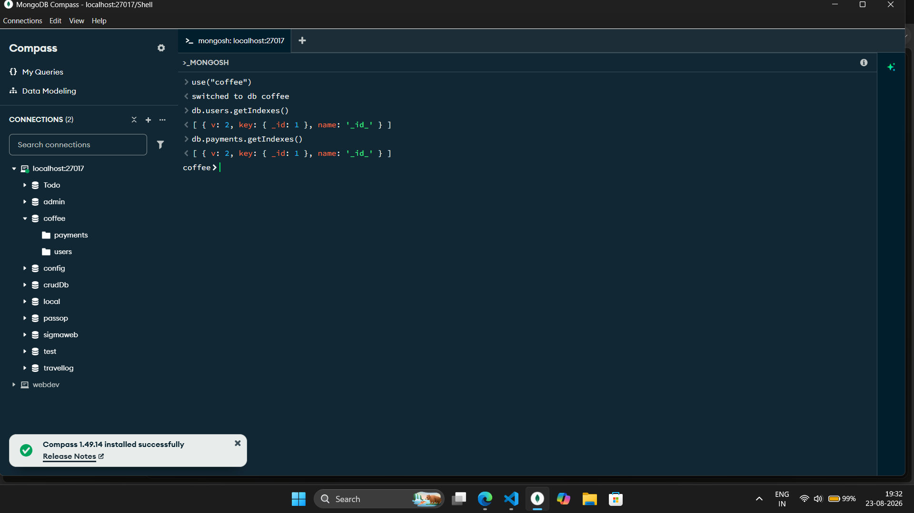
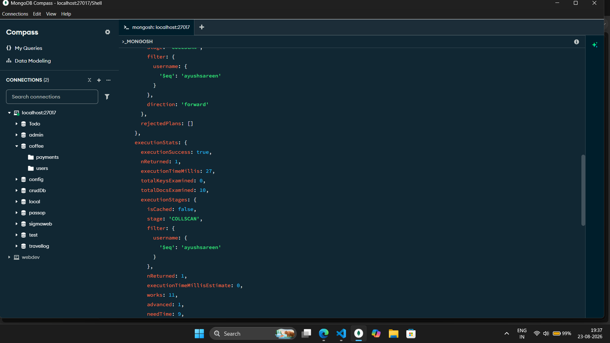
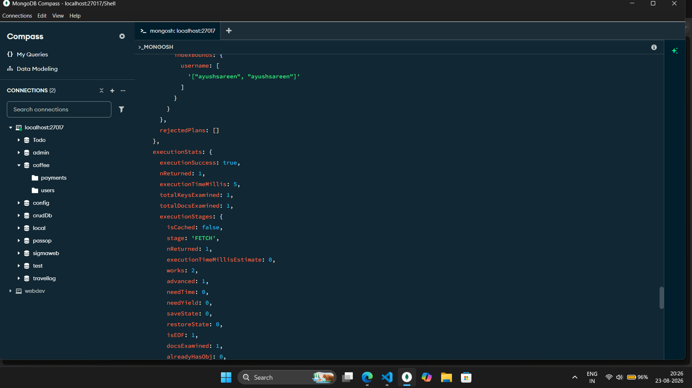
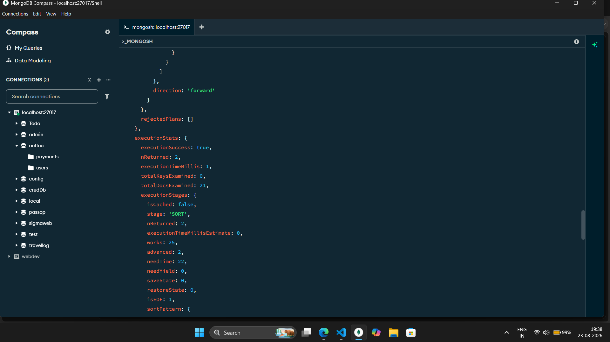
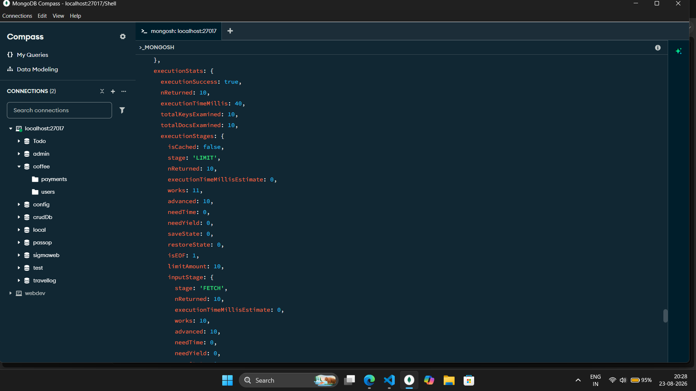
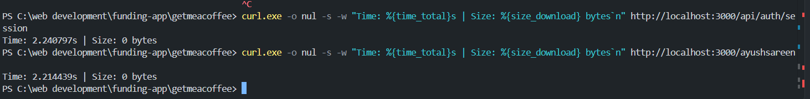

<div align="center">

# ☕ GetMeACoffee — A Creator Funding Platform

**Fund your passion, one coffee at a time.**

A crowdfunding platform where fans can support their favorite creators with a quick, no-hassle payment — no platform cut, instant payouts, and a personalized page every creator can call their own.

[Live Demo](https://get-me-acoffee-a-creator-funding-pl.vercel.app) · [Report a Bug](https://github.com/ayushsareen793/GetMeACOFFEE-A-Creator-Funding-Platform/issues)

</div>

---

## 📖 About The Project

GetMeACoffee is a full-stack crowdfunding platform inspired by "Buy Me a Coffee," built for creators — developers, artists, writers, streamers — to receive direct financial support from their fans. Every creator gets a personalized public page (`/username`) where supporters can send a payment along with a name and a short message, and creators get a live dashboard to track earnings, top supporters, and manage their profile.

Built entirely with the Next.js App Router, secured with NextAuth, powered by Razorpay for real payments, and backed by MongoDB — the whole flow, from signup to getting paid, works end to end.

### ✨ Key Features

- 🔐 **OAuth Authentication** — Sign in with GitHub or Google via NextAuth; new users get an auto-generated, collision-safe username on first login
- 🎨 **Personalized Creator Pages** — Each creator gets a unique `/username` page with profile picture, cover photo, and bio
- 💳 **Real Payments via Razorpay** — Supporters can send actual payments (INR) with a name and message attached
- ✅ **Server-Side Payment Verification** — Payment signatures are cryptographically verified before an order is marked complete, preventing spoofed "successful" payments
- 📊 **Creator Dashboard** — Creators can view and manage their profile, and see their top supporters
- 🏆 **Top Supporters List** — Automatically surfaces the top 10 highest payments received on a creator's page
- ✏️ **Editable Profiles** — Update name, username, bio, and images, with safe username-uniqueness checks on save
- 🚀 **Indexed Queries** — Targeted MongoDB indexes and `.lean()` reads keep profile lookups and top-supporter queries efficient at scale (see [Performance Optimization](#-performance-optimization))
- 🌑 **Custom Dark Purple UI** — A fully custom-designed dark theme (no component library), built with Tailwind CSS
- ⚡ **Deployed on Vercel** — Continuous deployment straight from the `master` branch via GitHub integration

---

## 🛠️ Tech Stack

| Layer | Technology |
|---|---|
| **Framework** | [Next.js 14](https://nextjs.org/) (App Router) |
| **UI Library** | [React 19](https://react.dev/) |
| **Styling** | [Tailwind CSS 4](https://tailwindcss.com/) |
| **Authentication** | [NextAuth.js](https://next-auth.js.org/) (GitHub & Google OAuth providers) |
| **Database** | [MongoDB](https://www.mongodb.com/) with [Mongoose](https://mongoosejs.com/) |
| **Payments** | [Razorpay](https://razorpay.com/) |
| **Notifications** | [React Toastify](https://fkhadra.github.io/react-toastify/) |
| **Password Hashing** | [bcryptjs](https://www.npmjs.com/package/bcryptjs) |
| **Deployment** | [Vercel](https://vercel.com/) |

---

## 📈 Project Metrics

| Metric | Value |
|---|---|
| **Commits** | 18 |
| **Stars / Forks** | 1 / 0 |
| **Deployment** | Live on Vercel with continuous deployment from GitHub |
| **OAuth providers** | 2 (GitHub, Google) |
| **Database models** | 2 (User, Payment) |
| **Database indexes added** | 4 (1 on `users`, 3 on `payments`) |
| **Server actions** | 4 (initiate payment, fetch user, fetch top payments, update profile) |
| **API routes** | 2 (NextAuth handler, Razorpay payment verification) |
| **Pages / routes** | 5 (landing, login, about, dashboard, dynamic `/[username]`) |
| **Reusable components** | 5 (Navbar, Footer, Dashboard, PaymentPage, SessionWrapper) |
| **Top supporters shown** | Top 10 highest payments per creator |
| **User lookup speed-up** | 81% faster (27 ms → 5 ms) |
| **Load-test dataset** | 5,000 seeded payment records |
| **Platform fee** | 0% |

---

## ⚡ Performance Optimization

Creator profile lookups and payment history queries were optimized by adding targeted MongoDB indexes and using `.lean()` queries in the server actions. Query plans were measured with MongoDB's `explain("executionStats")`.

**Test environment:** local MongoDB (`localhost:27017`, database `coffee`), Mongoose ODM, Next.js App Router, collections `users` (10 documents) and `payments`. Tested on 2026-08-23.

### What changed

| File | Change |
|---|---|
| `models/User.js` | Added `Userschema.index({ username: 1 })` |
| `models/Payment.js` | Added `{ to_user: 1 }`, `{ to_user: 1, done: 1, amount: -1 }`, and `{ to_user: 1, done: 1, createdAt: -1 }` |
| `actions/useractions.js` | Added `.lean()` to `fetchuser` and removed `.toObject()` |
| `scripts/applyIndexes.js` | Script to apply the indexes |

### Before: only the default `_id` index



### Query 1 — User lookup by username (runs on every creator page load)

| Metric | Before | After | Improvement |
|---|---|---|---|
| `executionTimeMillis` | 27 ms | 5 ms | **81% faster** |
| `totalDocsExamined` | 10 | 1 | **90% fewer documents scanned** |
| `totalKeysExamined` | 0 | 1 | Index used |
| `stage` | `COLLSCAN` | `FETCH` (via `IXSCAN`) | **No collection scan** |




### Query 2 — Top supporters (top 10 payments for a creator)

| Metric | Before (21 payments) | After (5,000+ payments) | Result |
|---|---|---|---|
| `totalDocsExamined` | 21 | 10 | **52% fewer documents scanned**, on a dataset ~240x larger |
| `totalKeysExamined` | 0 | 10 | Compound index used |
| `works` | 25 | 11 | **56% less work** |
| `stage` | `SORT` (in-memory) | `LIMIT` + `FETCH` | **No in-memory sort** |
| `executionTimeMillis` | 1 ms | 40 ms | Not directly comparable: different dataset sizes |

The compound index on `to_user + done + amount` lets MongoDB read just the 10 highest payments in index order instead of scanning and sorting every payment for a creator. Examined documents stay at 10 no matter how many payments a creator receives.




### Baseline API timings (before optimization)

| Endpoint | Response time |
|---|---|
| `/api/auth/session` | 2,259 ms |
| `/ayushsareen` (creator page) | 2,253 ms |

These include full Next.js server-side rendering, not just database time.



### Key takeaways

- The **`username` index** removed the collection scan on every creator page load.
- The **compound index** replaced in-memory sorting with an indexed `LIMIT` + `FETCH`.
- **`.lean()`** skips Mongoose document hydration in server actions.
- **Scale validated** with 5,000 seeded payment records, all tied to one creator, using `seed.js`.

---

## 📂 Project Structure

```
GetMeACOFFEE-A-Creator-Funding-Platform/
├── actions/
│   └── useractions.js        # Server actions: initiate payment, fetch user, fetch top payments, update profile
├── app/
│   ├── [username]/            # Public creator page — profile + payment form
│   ├── Login/                 # Login page (GitHub / Google OAuth)
│   ├── about/                 # About page
│   ├── dashboard/             # Creator dashboard
│   ├── api/
│   │   ├── auth/[...nextauth]/route.js   # NextAuth config & sign-in/session callbacks
│   │   └── razorpay/route.js             # Razorpay payment verification endpoint
│   ├── layout.js               # Root layout (Navbar, Footer, SessionWrapper)
│   └── page.js                 # Landing page
├── components/
│   ├── Dashboard.js            # Creator dashboard UI
│   ├── Navbar.js
│   ├── Footer.js
│   ├── PaymentPage.js          # Payment form + Razorpay checkout trigger
│   └── SessionWrapper.js       # NextAuth SessionProvider wrapper
├── db/
│   └── connectDb.js            # Mongoose connection helper
├── models/
│   ├── User.js                 # User schema (email, username, bio, profile/cover pics, Razorpay keys) + username index
│   └── Payment.js              # Payment schema (order id, amount, message, status) + 3 compound indexes
├── scripts/
│   └── applyIndexes.js         # Applies the MongoDB indexes
├── screenshots/                # Before/after query-plan and timing screenshots
└── public/                     # Static assets (logo, GIFs, icons)
```

---

## 🗄️ Data Models

**User**
| Field | Type | Notes |
|---|---|---|
| `email` | String | required |
| `username` | String | required, unique per creator, indexed |
| `name`, `bio` | String | bio capped at 500 chars |
| `profilepic`, `coverpic` | String | |
| `razorpayid`, `razorpaysecret` | String | optional, for creator-owned payout keys |

**Payment**
| Field | Type | Notes |
|---|---|---|
| `to_user` | String | creator's username receiving the payment, indexed |
| `oid` | String | Razorpay order ID |
| `name`, `message` | String | supporter's name and message |
| `amount` | Number | |
| `done` | Boolean | flips to `true` only after signature verification |

**Indexes:** `users` → `{ username: 1 }` · `payments` → `{ to_user: 1 }`, `{ to_user: 1, done: 1, amount: -1 }`, `{ to_user: 1, done: 1, createdAt: -1 }`

---

## 🚀 Getting Started

### Prerequisites

- Node.js 18+
- A [MongoDB](https://www.mongodb.com/atlas) database (Atlas or local)
- A [Razorpay](https://razorpay.com/) account (test mode is fine) for API keys
- OAuth apps registered on [GitHub](https://github.com/settings/developers) and [Google Cloud Console](https://console.cloud.google.com/)

### Installation

1. **Clone the repo**
   ```bash
   git clone https://github.com/ayushsareen793/GetMeACOFFEE-A-Creator-Funding-Platform.git
   cd GetMeACOFFEE-A-Creator-Funding-Platform
   ```

2. **Install dependencies**
   ```bash
   npm install
   ```

3. **Set up environment variables**

   Create a `.env.local` file in the root directory:
   ```env
   # MongoDB
   MONGODB_URI=your_mongodb_connection_string

   # NextAuth OAuth Providers
   GITHUB_ID=your_github_oauth_client_id
   GITHUB_SECRET=your_github_oauth_client_secret
   GOOGLE_CLIENT_ID=your_google_oauth_client_id
   GOOGLE_CLIENT_SECRET=your_google_oauth_client_secret

   # Razorpay
   NEXT_PUBLIC_KEY_ID=your_razorpay_key_id
   KEY_SECRET=your_razorpay_key_secret

   # App URL (used for post-payment redirect)
   NEXT_PUBLIC_URL=http://localhost:3000
   ```

4. **Apply the database indexes**
   ```bash
   node scripts/applyIndexes.js
   ```

5. **Run the development server**
   ```bash
   npm run dev
   ```

   Open [http://localhost:3000](http://localhost:3000) in your browser.

### Build for production

```bash
npm run build
npm run start
```

---

## 💡 How It Works

1. A creator signs up via GitHub or Google. On first login, a `User` document is created automatically with a unique username derived from their email (with collision handling for reserved words and duplicates).
2. The creator shares their page: `yourapp.com/username`.
3. A supporter visits the page, enters their name, a message, and an amount, and hits pay.
4. A Razorpay order is created server-side and a matching `Payment` record is stored as pending.
5. After checkout, Razorpay's signature is verified server-side (`/api/razorpay`) before the payment is marked `done` — this stops anyone from faking a successful payment client-side.
6. The creator's dashboard and public page reflect the new payment, and the top 10 highest supporters are shown.

---

## 🌐 Deployment

This project is deployed on **Vercel** with continuous deployment connected directly to the GitHub repository — every push to `master` triggers a new production build automatically.

**Live:** [get-me-acoffee-a-creator-funding-pl.vercel.app](https://get-me-acoffee-a-creator-funding-pl.vercel.app)

To deploy your own copy, import the repo into Vercel and add the same environment variables listed above in the Vercel project settings.

---

## 🗺️ Roadmap

- [ ] Per-creator custom Razorpay payout keys (fields already exist in the schema)
- [ ] Email notifications on new support
- [ ] Public supporter leaderboard page
- [ ] Multi-currency support

---

## 👤 Author

**Ayush Sareen**
- GitHub: [@ayushsareen793](https://github.com/ayushsareen793)

---

## 📄 License

This project currently has no license file. All rights reserved unless a license is added.
